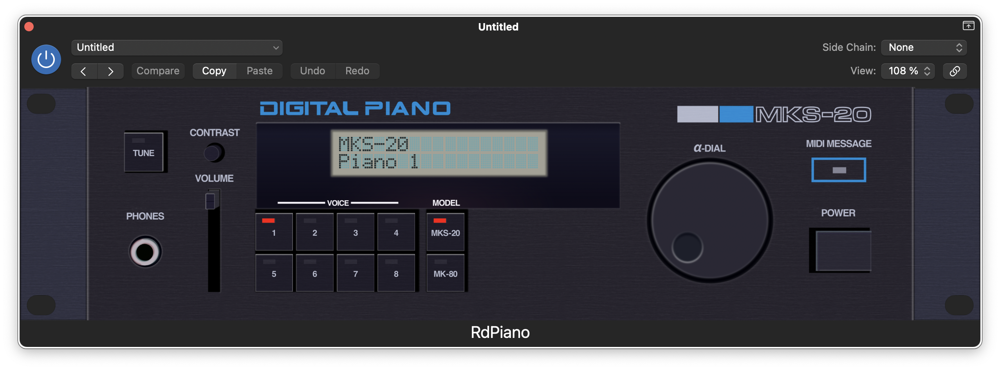

# RdPiano [](https://github.com/giulioz/rdpiano/actions/workflows/main.yml)

RdPiano accurately emulates SA-synthesis digital pianos, such as the Roland MKS-20, RD1000 and the Rhodes MK-80 electric piano.
It simulates the CPU-B board reused in different models, emulating the CPU and the custom chips. The emulation of the custom chips is derived from silicon analysis.
It also approximates the BBD chorus and tremolo effect, albeit less accurately than the digital emulation.



**Demo video:** [https://www.youtube.com/watch?v=7w0uvZ-OZ7U](https://www.youtube.com/watch?v=7w0uvZ-OZ7U)

[](https://www.youtube.com/watch?v=7w0uvZ-OZ7U)

## Plugin downloads

- [MacOS AU](https://github.com/giulioz/rdpiano/releases/download/latest/rdpiano_juce.component.macOS.zip)
- [MacOS VSTi](https://github.com/giulioz/rdpiano/releases/download/latest/rdpiano_juce.vst3.macOS.zip)
- [MacOS Standalone](https://github.com/giulioz/rdpiano/releases/download/latest/rdpiano_juce.app.macOS.zip)
- [Windows VSTi](https://github.com/giulioz/rdpiano/releases/download/latest/rdpiano_juce.vst3)
- [Windows Standalone](https://github.com/giulioz/rdpiano/releases/download/latest/rdpiano_juce.exe)

**NOTE:** Due to a bug, it's possible for some versions to produce no sound when first loaded. To fix it, please change the current patch at least once.

**Having trouble with MacOS?** You probably need to run this command on a terminal:

```sudo xattr -rd com.apple.quarantine /Users/<yourusername>/Library/Audio/Plug-Ins/Components/rdpiano_juce.component```

More info on this guide: https://www.osirisguitar.com/2020/04/01/how-to-make-unsigned-vsts-work-in-macos-catalina/

## Content

- **rdpiano_juce**: a plugin (VSTi/AU) version of the emulator, to be used with DAWs
- **librdpiano**: a dependency-free version of the emulator, to be used as a library in other software, also builds a test standalone app with SDL
- **re_stuff**: tooling used during the reverse engineering process, mostly for educational purposes

## Acknowledgements

- 6800 CPU emulation code taken from [MAME](https://github.com/mamedev/mame)
- [InfoSecDJ](https://siliconpr0n.org/archive/doku.php?id=infosecdj:start), [Furrtek](http://furrtek.free.fr/), Jotego, Skutis and others for the help with silicon RE
- [Sean Costello](https://valhalladsp.com/) for the [info](https://gearspace.com/board/showpost.php?p=9200326&postcount=18) on how to implement the chorus effect
- Dominic Mazzoni for the audio resample library
- [probonopd](https://github.com/probonopd) for the CI pipelines for building the JUCE plugin
